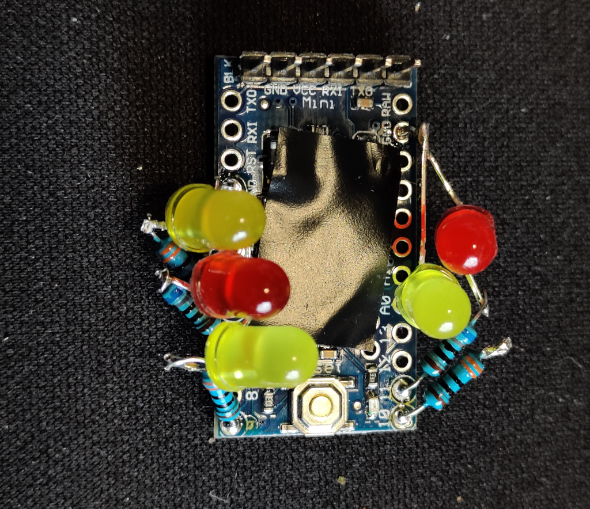
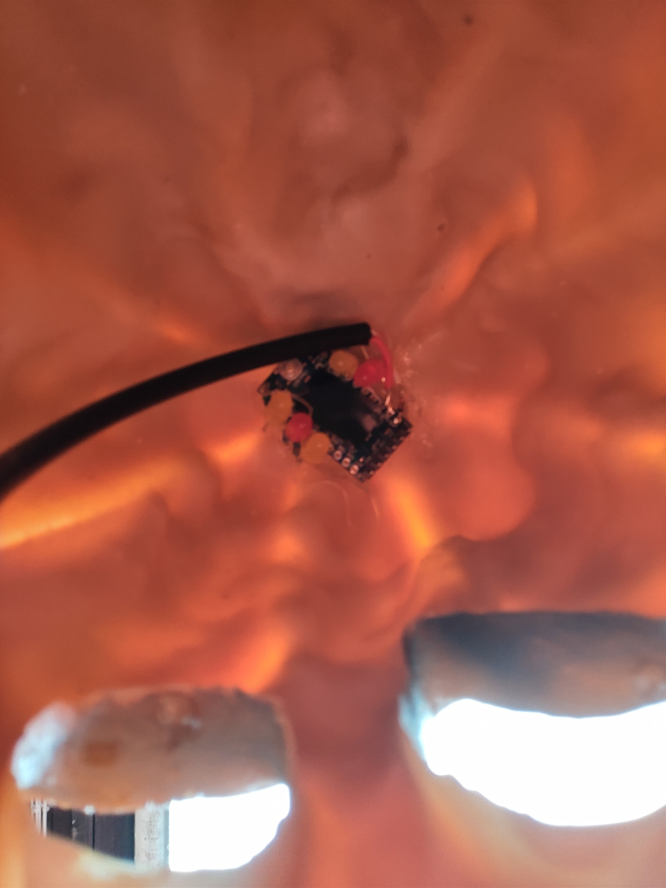

# Pumpkin Flames
A simple and small Halloween project to simulate some flames for a pumpkin display using an Arduino Pro Mini and five LED:s with five resistors.

The aim was to make a fairly realistic flame appearance to cast some light within a plastic pumpkin for Halloween. The components are soldered straight onto the Arduino Pro Mini board and then glued at the top of the pumpkin using a gluegun.

The code was written using PlatformIO for an Arduino Pro Mini, but you can easily adjust it for probably any Arduino or similar processor.

This design is only drawing around 5-10mA per LED so it should not put any current strain on the microprocessor ports.

    
    
    

## Features
Brightness of five LED:s are independently controlled randomly in order to create a flickering effect similar to an open fire or candle flame.

## Hardware
I have used an Arduino Pro Mini for my circuit. See the [Pumpkin Flames rev 1.0 schematics](docs/Pumpkin%20Flames%20rev%201.0%20-%20schematics.pdf) (pdf).

### Parts used for this project
- 1 pcs Arduino Pro Mini board
- 3 pcs 5mm yellow LEDs (or any colour combination you like)
- 2 pcs 5mm red LEDs (or any colour combination you like)
- 3 pcs 330ohm 0.25W resistors (adjust resistances depending on actual LEDs used)
- 2 pcs 680ohm 0.25W resistors (adjust resistances depending on actual LEDs used)
- 1 pcs diode (for polarity protection)
- 1 pcs cable with 2 wires to connect to DC power
- 1 pcs 6-12V DC battery or power adaptor
